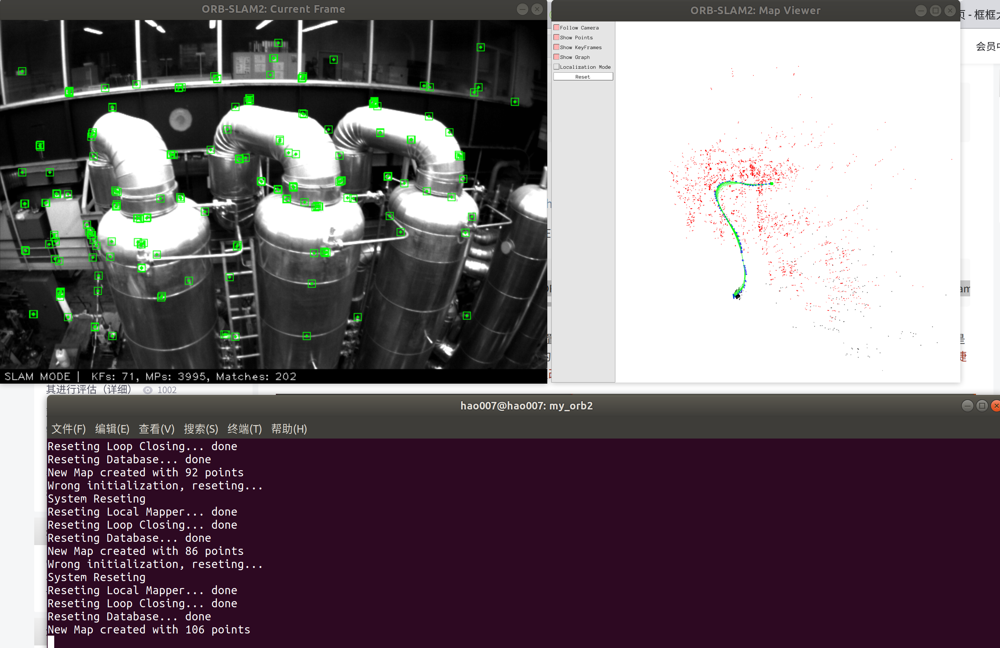
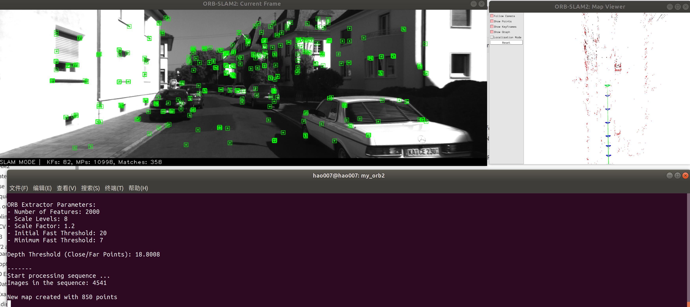
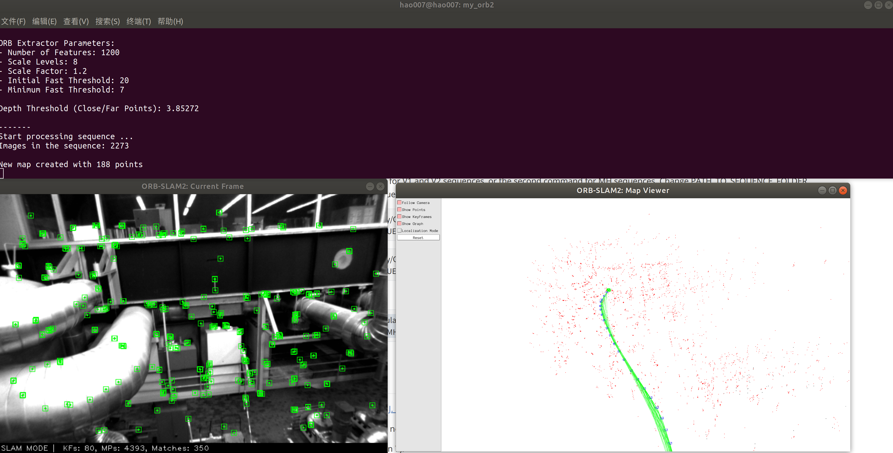
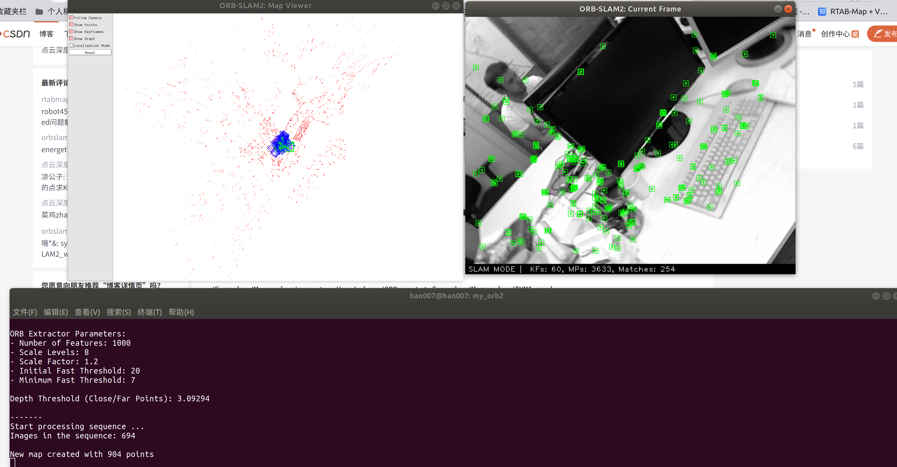
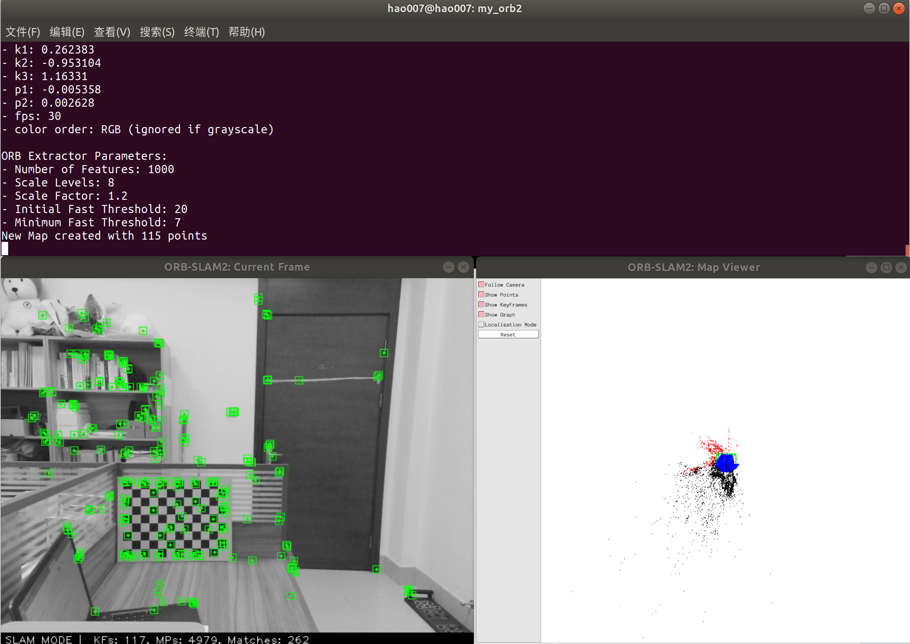
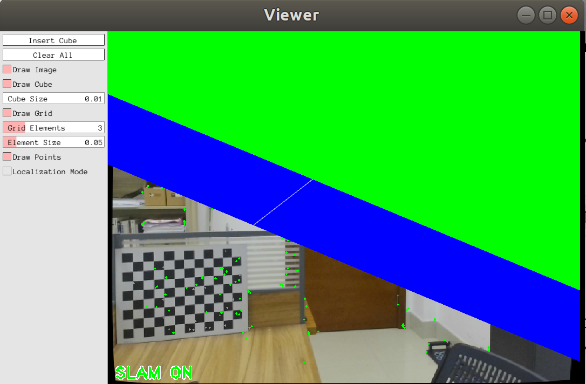
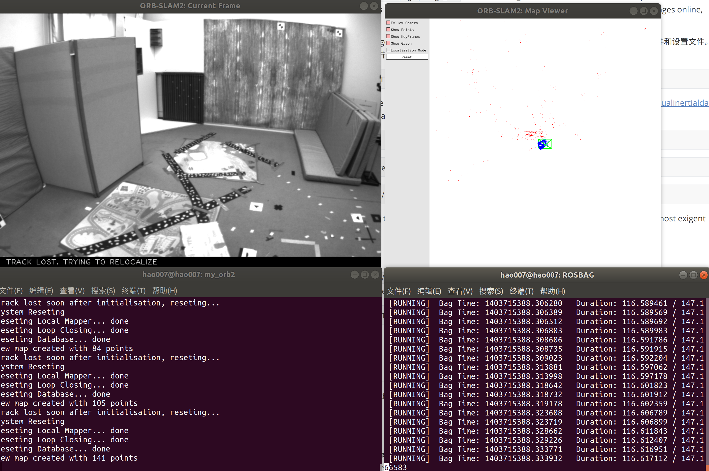

# hao_orb2

## 01 ORBSLAM2源码下载

此版本自己有更改很少部分方便编译，此版本会持续更新

```
git clone https://github.com/haohaoalt/my_orb2.git
```
We have tested the library in **Ubuntu 12.04**, **14.04** and **16.04**, but it should be easy to compile in other platforms. A powerful computer (e.g. i7) will ensure real-time performance and provide more stable and accurate results.

**C++11 or C++0x Compiler**

We use the new thread and chrono functionalities of C++11.

#### 


## 02 安装Pangolin

**Pangolin**

We use [Pangolin](https://github.com/stevenlovegrove/Pangolin) for visualization and user interface. Dowload and install instructions can be found at: https://github.com/stevenlovegrove/Pangolin.

```shell
sudo apt-get install libglew-dev
sudo apt-get install libboost-dev libboost-thread-dev libboost-filesystem-dev
sudo apt-get install libpython2.7-dev
git clone https://github.com/stevenlovegrove/Pangolin.git
cd Pangolin
git checkout v0.5       #即v0.5版本
mkdir build 
cd build
cmake -DCPP11_NO_BOOSR=1 .. 
make -j4 #j后面数字根据CPU核心数决定，机器配置差就写1或2
sudo make install
```

 ## 03 安装opencv

**OpenCV**

We use [OpenCV](http://opencv.org) to manipulate images and features. Dowload and install instructions can be found at: http://opencv.org. **Required at leat 2.4.3. Tested with OpenCV 2.4.11 and OpenCV 3.2**.

 ```shell
git clone https://github.com/haohaoalt/opencv3.4.5.git
cd opencv3.4.5
mkdir build
cd build
sudo cmake -D CMAKE_BUILD_TYPE=Release -D CMAKE_INSTALL_PREFIX=/usr/local ..
sudo make -j16
sudo make install
 ```
下面不配置也可，因为会把ROS自带的3.2.0顶掉
`sudo gedit /etc/ld.so.conf`
打开文件，并在文末加上一行

`include /usr/loacal/lib`


运行：

`sudo ldconfig`

修改bash.bashrc文件

`sudo gedit /etc/bash.bashrc`

在文末添加：

`PKG_CONFIG_PATH=$PKG_CONFIG_PATH:/usr/local/lib/pkgconfig`

`export PKG_CONFIG_PATH`

运行
`source /etc/bash.bashrc`

检查：
`pkg-config opencv --modversion`

测试是否正常安装 (成功会出现带“hello opcv” 字样的窗口)
```shell
 cd opencv-3.4.5/samples/cpp/example_cmake 
 cmake . 
 make 
 ./opencv_example
```

## 04 安装Eigen3

**Eigen3**

Required by g2o (see below). Download and install instructions can be found at: http://eigen.tuxfamily.org. **Required at least 3.1.0**.

```shell
git clone https://github.com/haohaoalt/eigen3.3.7.git
cd eigen3.3.7
mkdir build
cd build
cmake ..
sudo make install
```
安装后 头文件安装在`/usr/local/include/eigen3/`
移动头文件

`sudo cp -r /usr/local/include/eigen3/Eigen /usr/local/include`

 备注：在很多程序中include 时经常使用#include <Eigen/Dense> 而不是使用#include<eigen3/Eigen/Dense> 所以要做下处理。

## 05 安装ORB-SLAM2

**DBoW2 and g2o (Included in Thirdparty folder)**

We use modified versions of the [DBoW2](https://github.com/dorian3d/DBoW2) library to perform place recognition and [g2o](https://github.com/RainerKuemmerle/g2o) library to perform non-linear optimizations. Both modified libraries (which are BSD) are included in the *Thirdparty* folder.

```shell
https://github.com/haohaoalt/my_orb2.git
cd my_orb2
chmod +x build.sh
./build.sh
#This will create **libORB_SLAM2.so**  at *lib* folder and the executables **mono_tum**, **mono_kitti**, **rgbd_tum**, **stereo_kitti**, **mono_euroc** and #**stereo_euroc** in *Examples* folder.
chmod +x build_ros.sh
//export ROS_PACKAGE_PATH=${ROS_PACKAGE_PATH}:/home/ziyuan/catkin_ws/src/ORB_SLAM2/Examples/ROS
export ROS_PACKAGE_PATH=${ROS_PACKAGE_PATH}:~/my_orb2/Examples/ROS 
sudo rosdep init
rosdep update
./build_ros.sh
```

## 06 ORBSLAM2单目运行实例

### 6.1 TUM数据集运行

**官网**

TUM Dataset

1. Download a sequence from http://vision.in.tum.de/data/datasets/rgbd-dataset/download and uncompress it.

2. Execute the following command. Change `TUMX.yaml` to TUM1.yaml,TUM2.yaml or TUM3.yaml for freiburg1, freiburg2 and freiburg3 sequences respectively. Change `PATH_TO_SEQUENCE_FOLDER`to the uncompressed sequence folder.

```
./Examples/Monocular/mono_tum Vocabulary/ORBvoc.txt Examples/Monocular/TUMX.yaml PATH_TO_SEQUENCE_FOLDER
```

**自己**

```
./Examples/Monocular/mono_tum Vocabulary/ORBvoc.txt Examples/Monocular/TUM1.yaml /media/hao007/datasets/tum/rgbd_dataset_freiburg1_xyz
```

会在当前目录下生成 KeyFrameTrajectory.txt 格式为：时间戳+平移+旋转（四元数形式）

### 6.2 KITTI Dataset  

**官网**

1. Download the dataset (grayscale images) from http://www.cvlibs.net/datasets/kitti/eval_odometry.php 

2. Execute the following command. Change `KITTIX.yaml`by KITTI00-02.yaml, KITTI03.yaml or KITTI04-12.yaml for sequence 0 to 2, 3, and 4 to 12 respectively. Change `PATH_TO_DATASET_FOLDER` to the uncompressed dataset folder. Change `SEQUENCE_NUMBER` to 00, 01, 02,.., 11. 

```
./Examples/Monocular/mono_kitti Vocabulary/ORBvoc.txt Examples/Monocular/KITTIX.yaml PATH_TO_DATASET_FOLDER/dataset/sequences/SEQUENCE_NUMBER
```

**自己**

```
 ./Examples/Monocular/mono_kitti Vocabulary/ORBvoc.txt Examples/Monocular/KITTI00-02.yaml /media/hao007/datasets/KITTI/kitti_odometry/sequences/00
```


### 6.3 EuRoC Dataset

**官网：**

1. Download a sequence (ASL format) from http://projects.asl.ethz.ch/datasets/doku.php?id=kmavvisualinertialdatasets

2. Execute the following first command for V1 and V2 sequences, or the second command for MH sequences. Change PATH_TO_SEQUENCE_FOLDER and SEQUENCE according to the sequence you want to run.

```
./Examples/Monocular/mono_euroc Vocabulary/ORBvoc.txt Examples/Monocular/EuRoC.yaml PATH_TO_SEQUENCE_FOLDER/mav0/cam0/data Examples/Monocular/EuRoC_TimeStamps/SEQUENCE.txt 
```

```
./Examples/Monocular/mono_euroc Vocabulary/ORBvoc.txt Examples/Monocular/EuRoC.yaml PATH_TO_SEQUENCE/cam0/data Examples/Monocular/EuRoC_TimeStamps/SEQUENCE.txt 
```

**自己：**

```
./Examples/Monocular/mono_euroc Vocabulary/ORBvoc.txt Examples/Monocular/EuRoC.yaml /media/hao007/datasets/EuRoC/MH_05_difficult/mav0/cam0/data Examples/Monocular/EuRoC_TimeStamps/MH05.txt
```



## 07 ORBSLAM2双目运行实例

### 7.1 KITTI Dataset

**官网：**

1. Download the dataset (grayscale images) from http://www.cvlibs.net/datasets/kitti/eval_odometry.php 

2. Execute the following command. Change `KITTIX.yaml`to KITTI00-02.yaml, KITTI03.yaml or KITTI04-12.yaml for sequence 0 to 2, 3, and 4 to 12 respectively. Change `PATH_TO_DATASET_FOLDER` to the uncompressed dataset folder. Change `SEQUENCE_NUMBER` to 00, 01, 02,.., 11. 

```
./Examples/Stereo/stereo_kitti Vocabulary/ORBvoc.txt Examples/Stereo/KITTIX.yaml PATH_TO_DATASET_FOLDER/dataset/sequences/SEQUENCE_NUMBER
```

**自己：**

```
 ./Examples/Stereo/stereo_kitti Vocabulary/ORBvoc.txt Examples/Stereo/KITTI00-02.yaml /media/hao007/datasets/KITTI/kitti_odometry/sequences/00
```



### 7.2 EuRoC Dataset

**官网：**

1. Download a sequence (ASL format) from http://projects.asl.ethz.ch/datasets/doku.php?id=kmavvisualinertialdatasets

2. Execute the following first command for V1 and V2 sequences, or the second command for MH sequences. Change PATH_TO_SEQUENCE_FOLDER and SEQUENCE according to the sequence you want to run.

```
./Examples/Stereo/stereo_euroc Vocabulary/ORBvoc.txt Examples/Stereo/EuRoC.yaml PATH_TO_SEQUENCE/mav0/cam0/data PATH_TO_SEQUENCE/mav0/cam1/data Examples/Stereo/EuRoC_TimeStamps/SEQUENCE.txt
```

```
./Examples/Stereo/stereo_euroc Vocabulary/ORBvoc.txt Examples/Stereo/EuRoC.yaml PATH_TO_SEQUENCE/cam0/data PATH_TO_SEQUENCE/cam1/data Examples/Stereo/EuRoC_TimeStamps/SEQUENCE.txt
```

**自己：**

```
./Examples/Stereo/stereo_euroc Vocabulary/ORBvoc.txt Examples/Stereo/EuRoC.yaml /media/hao007/datasets/EuRoC/MH_05_difficult/mav0/cam0/data /media/hao007/datasets/EuRoC/MH_05_difficult/mav0/cam1/data  Examples/Stereo/EuRoC_TimeStamps/MH05.txt
```



## 08 ORBSLAM2 RGB-D 实例

**TUM Dataset**

**官网：**

1. Download a sequence from http://vision.in.tum.de/data/datasets/rgbd-dataset/download and uncompress it.

2. Associate RGB images and depth images using the python script [associate.py](http://vision.in.tum.de/data/datasets/rgbd-dataset/tools). We already provide associations for some of the sequences in *Examples/RGB-D/associations/*. You can generate your own associations file executing:

  ```
python associate.py PATH_TO_SEQUENCE/rgb.txt PATH_TO_SEQUENCE/depth.txt > associations.txt
  ```

3. Execute the following command. Change `TUMX.yaml` to TUM1.yaml,TUM2.yaml or TUM3.yaml for freiburg1, freiburg2 and freiburg3 sequences respectively. Change `PATH_TO_SEQUENCE_FOLDER`to the uncompressed sequence folder. Change `ASSOCIATIONS_FILE` to the path to the corresponding associations file.

  ```
./Examples/RGB-D/rgbd_tum Vocabulary/ORBvoc.txt Examples/RGB-D/TUMX.yaml PATH_TO_SEQUENCE_FOLDER ASSOCIATIONS_FILE
  ```

**自己：**

```
./Examples/RGB-D/rgbd_tum Vocabulary/ORBvoc.txt Examples/RGB-D/TUM1.yaml /media/hao007/datasets/tum/rgbd_dataset_freiburg1_rpy /media/hao007/datasets/tum/rgbd_dataset_freiburg1_rpy/associations.txt 
```





## 09 ORBSLAM2 ROS实例

**ROS (optional)**

We provide some examples to process the live input of a monocular, stereo or RGB-D camera using [ROS](ros.org). Building these examples is optional. In case you want to use ROS, a version Hydro or newer is needed.

### 9.1 为 mono、monoAR、stereo 和 RGB-D 构建节点

1. Add the path including *Examples/ROS/ORB_SLAM2* to the ROS_PACKAGE_PATH environment variable. Open .bashrc file and add at the end the following line. Replace PATH by the folder where you cloned ORB_SLAM2:

  ```
export ROS_PACKAGE_PATH=${ROS_PACKAGE_PATH}:PATH/ORB_SLAM2/Examples/ROS
  ```

2. Execute `build_ros.sh` script:

  ```
chmod +x build_ros.sh
./build_ros.sh
  ```

### 9.2 运行单目节点

**官网：**

For a monocular input from topic `/camera/image_raw` run node ORB_SLAM2/Mono. You will need to provide the vocabulary file and a settings file. See the monocular examples above.

  ```
rosrun ORB_SLAM2 Mono PATH_TO_VOCABULARY PATH_TO_SETTINGS_FILE
  ```

**自己：**

启动单目相机节点

```
cd hao_camera_launch
catkin_make
source devel/setup.bash
roslaunch usb_cam usb_cam_orb2_mono.launch 
//此launch文件发布的图像话题为适配ORBSLAM2实时单目模式改为/camera/image_raw，很多教程改源码而不是改相机话题这件事不是很理解
```

```
 rosrun ORB_SLAM2 Mono Vocabulary/ORBvoc.txt Examples/Monocular/orb_ros_mono.yaml   //这个地方参数文件用的TUM1 其实是不正确的 应该用自己相机的参数
```



### 9.3 运行单目增强现实演示

**官网：**

This is a demo of augmented reality where you can use an interface to insert virtual cubes in planar regions of the scene.
The node reads images from topic `/camera/image_raw`.

  ```
rosrun ORB_SLAM2 MonoAR PATH_TO_VOCABULARY PATH_TO_SETTINGS_FILE
  ```

**自己：**

```
rosrun ORB_SLAM2 MonoAR Vocabulary/ORBvoc.txt Examples/Monocular/orb_ros_mono.yaml
```




理论上是这样：


### 9.4 运行双目节点

**官网：**

For a stereo input from topic `/camera/left/image_raw` and `/camera/right/image_raw` run node ORB_SLAM2/Stereo. You will need to provide the vocabulary file and a settings file. If you **provide rectification matrices** (see Examples/Stereo/EuRoC.yaml example), the node will recitify the images online, **otherwise images must be pre-rectified**.

  ```
rosrun ORB_SLAM2 Stereo PATH_TO_VOCABULARY PATH_TO_SETTINGS_FILE ONLINE_RECTIFICATION
  ```

**Example**: Download a rosbag (e.g. V1_01_easy.bag) from the EuRoC dataset (http://projects.asl.ethz.ch/datasets/doku.php?id=kmavvisualinertialdatasets). Open 3 tabs on the terminal and run the following command at each tab:

  ```
roscore
  ```

  ```
rosrun ORB_SLAM2 Stereo Vocabulary/ORBvoc.txt Examples/Stereo/EuRoC.yaml true
  ```

  ```
rosbag play --pause V1_01_easy.bag /cam0/image_raw:=/camera/left/image_raw /cam1/image_raw:=/camera/right/image_raw
  ```

Once ORB-SLAM2 has loaded the vocabulary, press space in the rosbag tab. Enjoy!. Note: a powerful computer is required to run the most exigent sequences of this dataset.

**自己：**

对于来自主题“/camera/left/image_raw”和“/camera/right/image_raw”的立体输入，运行节点 ORB_SLAM2/Stereo。您将需要提供词汇表文件和设置文件。如果你**提供校正矩阵**（参见Examples/Stereo/EuRoC.yaml示例），节点将在线校正图像，**否则图像必须预先校正**。

```
roscore
rosrun ORB_SLAM2 Stereo Vocabulary/ORBvoc.txt Examples/Stereo/EuRoC.yaml false
rosbag play --pause V1_01_easy.bag /cam0/image_raw:=/camera/left/image_raw /cam1/image_raw:=/camera/right/image_raw
```




### 9.5 运行RGBD节点

**官网：**

For an RGB-D input from topics `/camera/rgb/image_raw` and `/camera/depth_registered/image_raw`, run node ORB_SLAM2/RGBD. You will need to provide the vocabulary file and a settings file. See the RGB-D example above.

  ```
rosrun ORB_SLAM2 RGBD PATH_TO_VOCABULARY PATH_TO_SETTINGS_FILE
  ```

**自己：**

```
roscore
rosbag play --pause rgbd_dataset_freiburg1_xyz.bag  /camera/rgb/image_color:=/camera/rgb/image_raw /camera/depth/image:=/camera/depth_registered/image_raw
rosrun ORB_SLAM2 RGBD  Vocabulary/ORBvoc.txt Examples/RGB-D/orb_ros_rgbd.yaml
```

有点卡，可能是bag包的帧率问题

## 10 其他相关

**Authors:** [Raul Mur-Artal](http://webdiis.unizar.es/~raulmur/), [Juan D. Tardos](http://webdiis.unizar.es/~jdtardos/), [J. M. M. Montiel](http://webdiis.unizar.es/~josemari/) and [Dorian Galvez-Lopez](http://doriangalvez.com/) ([DBoW2](https://github.com/dorian3d/DBoW2))

**13 Jan 2017**: OpenCV 3 and Eigen 3.3 are now supported.

**22 Dec 2016**: Added AR demo (see section 7).

ORB-SLAM2 is a real-time SLAM library for **Monocular**, **Stereo** and **RGB-D** cameras that computes the camera trajectory and a sparse 3D reconstruction (in the stereo and RGB-D case with true scale). It is able to detect loops and relocalize the camera in real time. We provide examples to run the SLAM system in the [KITTI dataset](http://www.cvlibs.net/datasets/kitti/eval_odometry.php) as stereo or monocular, in the [TUM dataset](http://vision.in.tum.de/data/datasets/rgbd-dataset) as RGB-D or monocular, and in the [EuRoC dataset](http://projects.asl.ethz.ch/datasets/doku.php?id=kmavvisualinertialdatasets) as stereo or monocular. We also provide a ROS node to process live monocular, stereo or RGB-D streams. **The library can be compiled without ROS**. ORB-SLAM2 provides a GUI to change between a *SLAM Mode* and *Localization Mode*, see section 9 of this document.

<a href="https://www.youtube.com/embed/ufvPS5wJAx0" target="_blank"></a>
<a href="https://www.youtube.com/embed/T-9PYCKhDLM" target="_blank"></a>
<a href="https://www.youtube.com/embed/kPwy8yA4CKM" target="_blank"></a>

Related Publications:

[Monocular] Raúl Mur-Artal, J. M. M. Montiel and Juan D. Tardós. **ORB-SLAM: A Versatile and Accurate Monocular SLAM System**. *IEEE Transactions on Robotics,* vol. 31, no. 5, pp. 1147-1163, 2015. (**2015 IEEE Transactions on Robotics Best Paper Award**). **[PDF](http://webdiis.unizar.es/~raulmur/MurMontielTardosTRO15.pdf)**.

[Stereo and RGB-D] Raúl Mur-Artal and Juan D. Tardós. **ORB-SLAM2: an Open-Source SLAM System for Monocular, Stereo and RGB-D Cameras**. *IEEE Transactions on Robotics,* vol. 33, no. 5, pp. 1255-1262, 2017. **[PDF](https://128.84.21.199/pdf/1610.06475.pdf)**.

[DBoW2 Place Recognizer] Dorian Gálvez-López and Juan D. Tardós. **Bags of Binary Words for Fast Place Recognition in Image Sequences**. *IEEE Transactions on Robotics,* vol. 28, no. 5, pp.  1188-1197, 2012. **[PDF](http://doriangalvez.com/php/dl.php?dlp=GalvezTRO12.pdf)**

**License**

ORB-SLAM2 is released under a [GPLv3 license](https://github.com/raulmur/ORB_SLAM2/blob/master/License-gpl.txt). For a list of all code/library dependencies (and associated licenses), please see [Dependencies.md](https://github.com/raulmur/ORB_SLAM2/blob/master/Dependencies.md).

For a closed-source version of ORB-SLAM2 for commercial purposes, please contact the authors: orbslam (at) unizar (dot) es.

If you use ORB-SLAM2 (Monocular) in an academic work, please cite:

    @article{murTRO2015,
      title={{ORB-SLAM}: a Versatile and Accurate Monocular {SLAM} System},
      author={Mur-Artal, Ra\'ul, Montiel, J. M. M. and Tard\'os, Juan D.},
      journal={IEEE Transactions on Robotics},
      volume={31},
      number={5},
      pages={1147--1163},
      doi = {10.1109/TRO.2015.2463671},
      year={2015}
     }

if you use ORB-SLAM2 (Stereo or RGB-D) in an academic work, please cite:

    @article{murORB2,
      title={{ORB-SLAM2}: an Open-Source {SLAM} System for Monocular, Stereo and {RGB-D} Cameras},
      author={Mur-Artal, Ra\'ul and Tard\'os, Juan D.},
      journal={IEEE Transactions on Robotics},
      volume={33},
      number={5},
      pages={1255--1262},
      doi = {10.1109/TRO.2017.2705103},
      year={2017}
     }


## 11 Processing your own sequences
You will need to create a settings file with the calibration of your camera. See the settings file provided for the TUM and KITTI datasets for monocular, stereo and RGB-D cameras. We use the calibration model of OpenCV. See the examples to learn how to create a program that makes use of the ORB-SLAM2 library and how to pass images to the SLAM system. Stereo input must be synchronized and rectified. RGB-D input must be synchronized and depth registered.

## 12 SLAM and Localization Modes
You can change between the *SLAM* and *Localization mode* using the GUI of the map viewer.

**SLAM Mode**

This is the default mode. The system runs in parallal three threads: Tracking, Local Mapping and Loop Closing. The system localizes the camera, builds new map and tries to close loops.

**Localization Mode**

This mode can be used when you have a good map of your working area. In this mode the Local Mapping and Loop Closing are deactivated. The system localizes the camera in the map (which is no longer updated), using relocalization if needed. 

